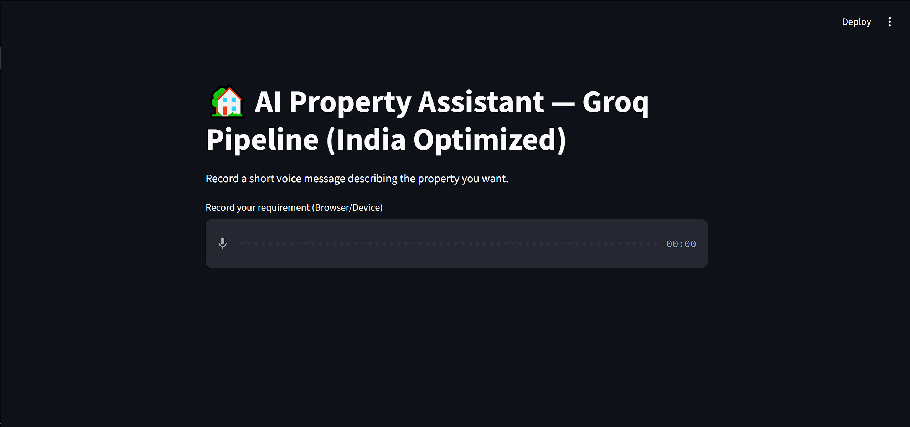
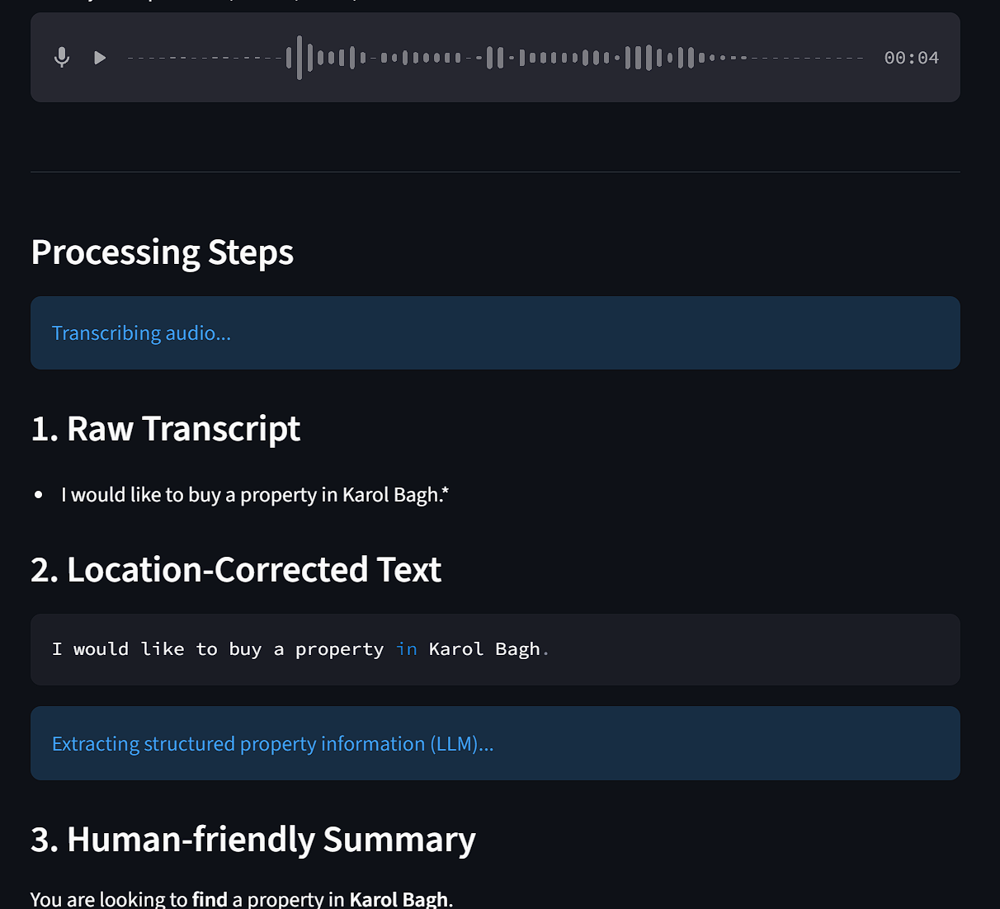
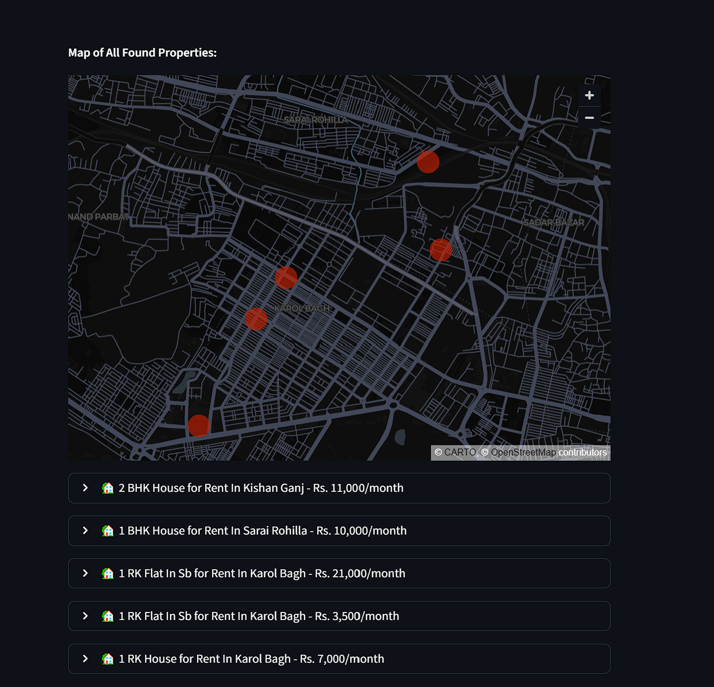
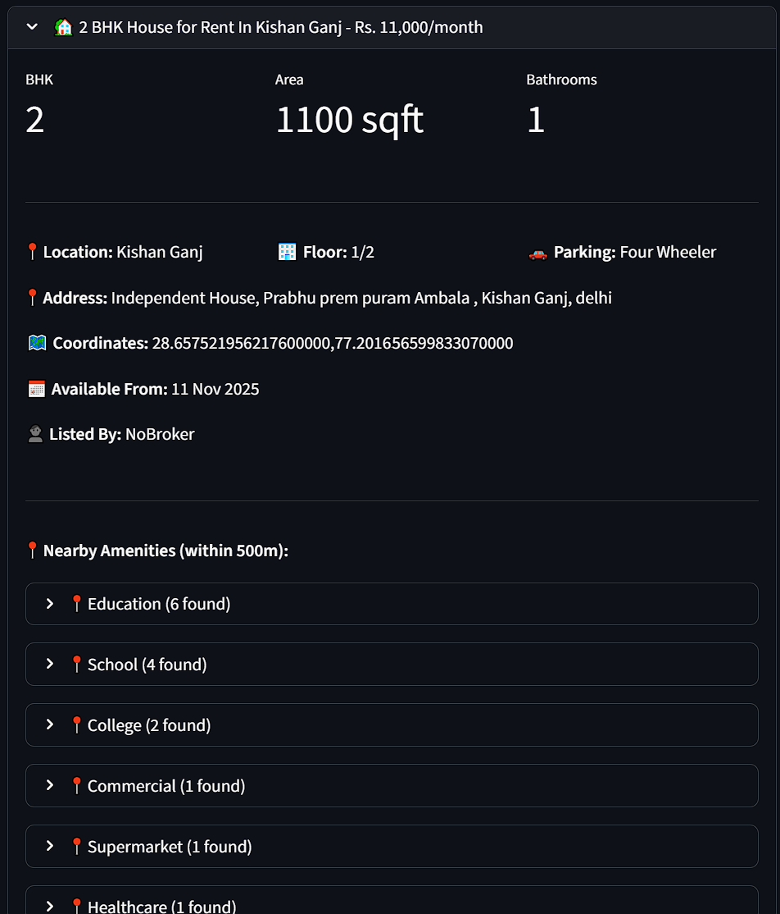
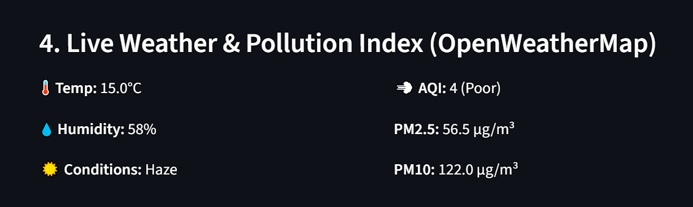
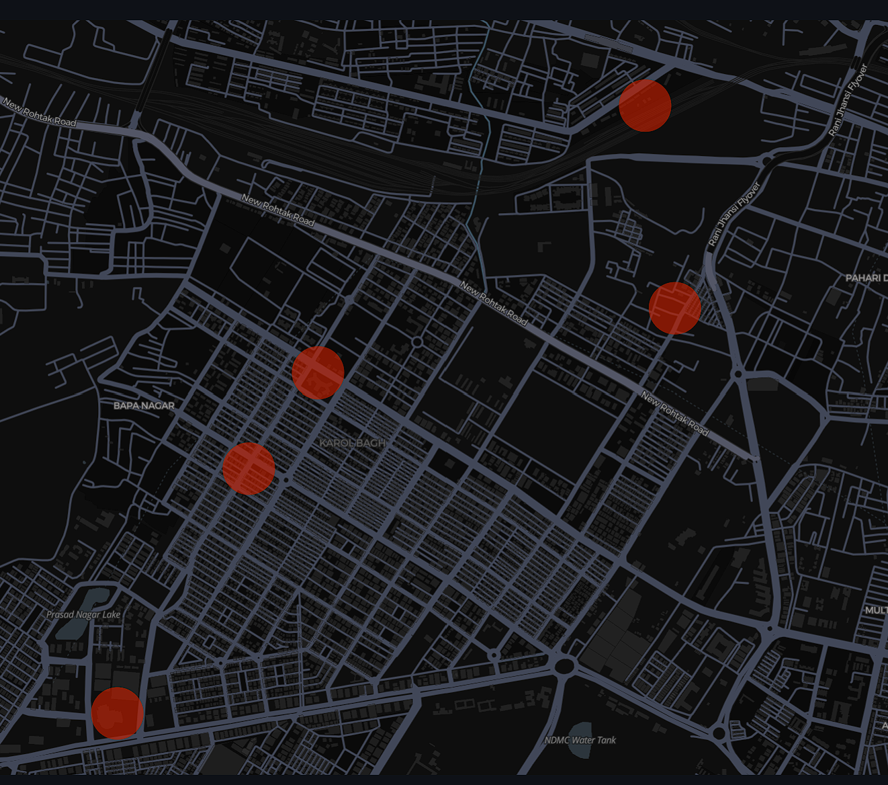

# AI Property Assistant — Groq Pipeline (India Optimized)

An intelligent voice-powered property search assistant that helps users find properties in India using natural language voice commands. The application uses AI to transcribe speech, extract property requirements, fetch real property listings, and provide comprehensive location insights including weather, air quality, and nearby amenities.

##  Features

### Core Functionality
- **Voice Input**: Record property requirements using your device's microphone
- **AI Transcription**: Powered by Groq's Whisper Large v3 Turbo for accurate speech-to-text
- **Intelligent Parsing**: Uses Llama 3.3 70B to extract structured property requirements from natural language
- **Location Intelligence**: 
  - Geocoding and mapping using Geoapify
  - Nearby amenities discovery (schools, hospitals, restaurants, shopping)
  - Weather and air quality data from OpenWeatherMap
- **Real Property Listings**: Fetches live property data from NoBroker via API Market
- **Interactive Maps**: Visual property locations with Streamlit's native map component
- **Audio Summary**: Text-to-speech summary with automatic playback at 1.25x speed

### Advanced Features
- **Fuzzy Location Matching**: Corrects misspelled Indian city/location names
- **Property Details**: 
  - BHK configuration, area, price, parking
  - Floor information, availability dates
  - Nearby amenities for each property (within 500m radius)
- **Session Caching**: TTS results cached to avoid redundant API calls
- **Rate Limit Handling**: Automatic retry with exponential backoff for TTS API

##  Technology Stack

### AI & ML
- **Groq API**: 
  - Whisper Large v3 Turbo for speech transcription
  - Llama 3.3 70B Versatile for JSON extraction and natural language understanding
- **RapidFuzz**: Fuzzy string matching for location name correction

### APIs & Services
- **Geoapify**: Geocoding and Places API for location data and nearby amenities
- **OpenWeatherMap**: Real-time weather and air quality index (AQI) data
- **API Market**: NoBroker property listings integration
- **Google TTS (gTTS)**: Text-to-speech conversion with Indian English support

### Framework & Libraries
- **Streamlit**: Web application framework
- **Pandas**: Data manipulation and map visualization
- **Requests**: HTTP library for API calls

##  Prerequisites

- Python 3.8 or higher
- API Keys for:
  - Groq API
  - Geoapify API
  - OpenWeatherMap API
  - API Market (NoBroker)

##  Installation

1. **Clone the repository**
   ```bash
   git clone <repository-url>
   cd Assignment-Copy
   ```

2. **Install dependencies**
   ```bash
   pip install -r requirements.txt
   ```

3. **Set up Streamlit secrets**
   
   Create a `.streamlit/secrets.toml` file in your project root:
   ```toml
   GROQ_API_KEY = "your_groq_api_key"
   GEOAPIFY_API_KEY = "your_geoapify_api_key"
   OPENWEATHERMAP_API_KEY = "your_openweathermap_api_key"
   APIMARKET_KEY = "your_api_market_key"
   ```

4. **Run the application**
   ```bash
   streamlit run test.py
   ```

##  Usage

1. **Start the application**: The Streamlit app will open in your browser
2. **Record your requirement**: Click the microphone button and speak your property requirement
   - Example: "I would like to buy a property in Karol Bagh"
3. **View results**: The app will:
   - Transcribe your voice input
   - Extract property requirements
   - Show a human-friendly summary
   - Display weather and air quality information
   - Show matching property listings with details
   - Play an audio summary automatically

## 📸 Screenshots

### Main Interface

*Voice input interface for recording property requirements*

### Transcription & Processing

*AI-powered speech transcription and location correction*

### Property Listings

*Real-time property listings with detailed information*

### Property Details

*Individual property cards with amenities and nearby places*

### Weather & AQI

*Live weather and air quality information*

### Interactive Map

*Interactive map showing property locations*

> **Note**: To add screenshots, create a `screenshots/` folder in your project root and add your images there. Then update the image paths above to match your screenshot filenames.

##  Project Structure

```
Assignment-Copy/
├── test.py                 # Main application file
├── requirements.txt        # Python dependencies
├── README.md              # This file
├── screenshots/           # Application screenshots (optional)
│   ├── main-interface.png
│   ├── transcription.png
│   ├── property-listings.png
│   ├── property-details.png
│   ├── weather-aqi.png
│   └── map-view.png
├── .streamlit/
│   └── secrets.toml       # API keys (not in repo)
└── raw_api_response_*.json # Sample API responses
```

##  Key Components

### 1. Audio Transcription (`transcribe_audio`)
- Uses Groq's Whisper model for high-accuracy speech-to-text
- Handles temporary WAV file creation and cleanup

### 2. Location Correction (`correct_place_names`)
- Fuzzy matching against known Indian cities
- Corrects common misspellings and variations

### 3. JSON Extraction (`extract_json`)
- Uses Llama 3.3 70B to parse natural language into structured JSON
- Extracts: deal type, property type, budget, locations, bedrooms, bathrooms, amenities, timeline

### 4. Location Insights (`fetch_location_insights`)
- Geocoding via Geoapify
- Nearby places discovery (education, healthcare, catering, commercial)
- Returns coordinates and categorized amenities

### 5. Property Listings (`fetch_property_listings_market`)
- Fetches real property data from NoBroker API
- Parses JSON response with properties by locality
- Maps API fields to application schema
- Fetches nearby places for each property

### 6. Weather & AQI (`fetch_weather_and_aqi`)
- Current temperature, conditions, humidity
- Air Quality Index (AQI) with PM2.5 and PM10 readings

### 7. Text-to-Speech (`text_to_speech`)
- Converts summary text to speech
- Uses Indian English domain for better pronunciation
- Implements retry logic with exponential backoff
- Session-based caching to reduce API calls


## Troubleshooting

### TTS Rate Limit Errors (429)
- The app includes automatic retry logic with exponential backoff
- If errors persist, wait a few minutes and try again
- Consider using a different TTS service for production

### Audio Transcription Issues
- Ensure microphone permissions are granted
- Check that audio format is supported (WAV)
- Verify Groq API key is valid

### Property Listings Not Found
- Verify API Market key is correct
- Check that location coordinates are valid
- Ensure NoBroker API is accessible

## API Response Structure

The application expects property data in the following format:
```json
{
  "success": true,
  "data": {
    "propertiesByLocality": {
      "Location Name": [
        {
          "title": "Property title",
          "price": 10000,
          "propertySize": 500,
          "location": "Location Name",
          "googleMapsPin": "lat,lon",
          "bhk": "BHK2",
          "bath": 1,
          "address": "Full address",
          ...
        }
      ]
    }
  }
}
```

## License

This project is for educational/demonstration purposes.


